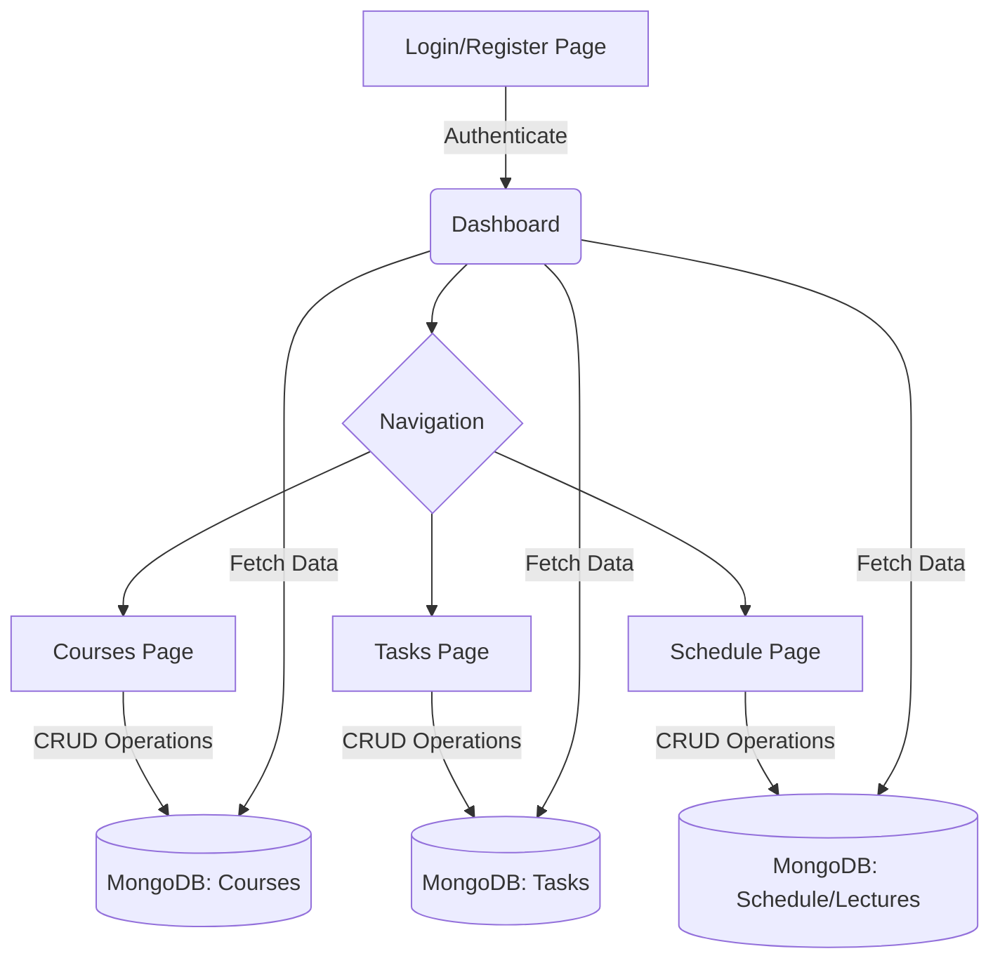
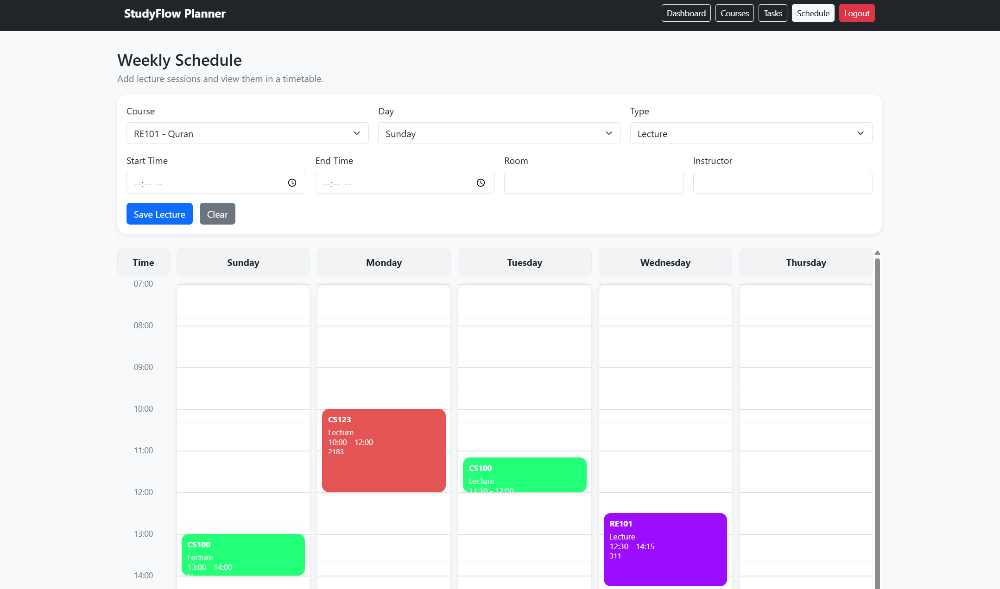
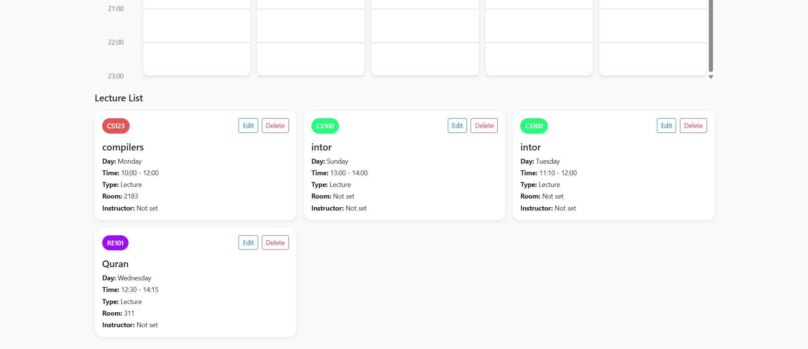

# StudyFlow Planner

## Overview
StudyFlow Planner is a comprehensive web application designed to help university students manage their academic life efficiently. It integrates course management, a Kanban-style task tracking dashboard, and a visual schedule builder into a single, cohesive platform. 

### Goals
- Provide a centralized hub for tracking courses, lectures, and assignments.
- Help students visualize their weekly schedule and impending tasks.
- Keep users organized through urgent, pending, and completed task categorizations.
- Enhance time management skills via an intuitive and responsive user interface.

### Distinguishing Feature
Unlike standard to-do list apps, StudyFlow Planner seamlessly integrates a **dynamic, visual university timetable** with a **Kanban-style task dashboard**. Tasks are inherently linked to specific courses, and the dashboard provides both a chronological schedule preview and urgency-based task columns side-by-side. 

---

## Team Members
*   **Mohammad Alturki** - 443018709
*   **Mohammed Taha** - 444000373
*   **Mohammad Almutairi** - 442015682
*   **Rakan alkhalifah** - 444005000

---

## Technologies Used

### Frontend (Client-side)
*   **HTML5:** Semantic structuring with no deprecated tags.
*   **CSS3:** Custom styling for layout and components.
*   **Bootstrap 5:** For responsive grids and rapid UI prototyping.
*   **JavaScript (ES6+):** Pure, Object-Oriented, raw JavaScript utilizing ES6 classes, Encapsulation, Promises, and the Fetch API. Communication between modules is achieved via custom events and callbacks (No React/Vue).

### Backend (Server-side)
*   **Node.js & Express.js:** RESTful API handling routing, server logic, and structured HTTP methods (GET for retrieving, POST for creating/updating).
*   **MongoDB & Mongoose:** NoSQL persistent data storage avoiding local file-system databases.
*   **Authentication:** Session-based user authentication using `express-session`, `connect-mongo` for session storage, and `bcrypt` for secure password hashing.

---

## Flow Chart


---

## Setup Instructions
To run this project locally, follow these steps:

1. **Clone the repository:**
   ```bash
   git clone https://github.com/g99v/cs1445-course-project.git
   cd cs1445-course-project-main
   ```
2. **Install dependencies:**
   ```bash
   npm install
   ```
3. **Configure Environment Variables:**
   Create a `.env` file in the root directory and add the following:
   ```env
   PORT=3000
   MONGO_URI=mongodb://localhost:27017/studyflow
   SESSION_SECRET=your_secret_key_here
   ```
   *(Note: Make sure MongoDB is installed and running on your system).*
4. **Run the server:**
   ```bash
   npm start
   ```
   *(For development with auto-restart, run `npm run dev`)*
5. **Access the application:**
   Open your browser and navigate to `http://localhost:3000`.

---

## Screenshots
- **Register Page:** ``
- **Dashboard View:** ``
- **Course Management:** ``
- **Task Management:** ``
- **Schedule Builder:**
  - 
  - 


---

## Future Work
*   **Push Notifications:** Implementing browser-based alerts for upcoming lectures and overdue assignments.
*   **Calendar Integration:** Allowing users to export their schedule to Google Calendar or Apple Calendar (via ICS files).
*   **Study Analytics:** A new module tracking time spent on each course vs. grades achieved.
*   **Dark Mode Toggle:** Enhancing the UI with a user-configurable dark theme.

---

## Resources
*   [Node.js Documentation](https://nodejs.org/en/docs/)
*   [Express.js Guide](https://expressjs.com/)
*   [Mongoose Documentation](https://mongoosejs.com/docs/guide.html)
*   [Bootstrap 5 Docs](https://getbootstrap.com/docs/5.3/getting-started/introduction/)
*   [MDN Web Docs (JavaScript)](https://developer.mozilla.org/en-US/docs/Web/JavaScript)
